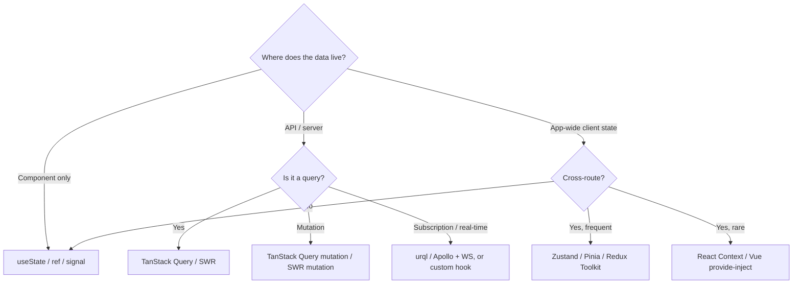

# Frontend Engineering Playbook

Framework-agnostic. React, Vue, Svelte, Solid, Astro, Next, Nuxt, Gatsby, Hugo, SvelteKit, Remix - the architecture decisions and CI discipline are the same; the framework is the implementation.

**Companion rule:** `260-frontend.mdc`. The rule is what auto-loads when an agent edits `.tsx` / `.vue` / `vite.config.*` / etc.; this skill is the depth.

---

## When to invoke

- Designing a new frontend project (greenfield)
- Auditing an existing frontend project (perf, a11y, security)
- Choosing between SPA / SSG / SSR / ISR / hybrid rendering
- Setting up Core Web Vitals tracking (lab + RUM)
- Picking state management (and unbreaking a Redux/Zustand-stuffed-with-server-data mess)
- Hitting an INP / LCP / CLS regression
- Wiring CI gates: bundle budget, axe-core, Lighthouse

Do not use for:

- Framework-specific syntax help (defer to framework docs)
- CSS architecture (BEM vs Tailwind vs CSS-in-JS - taste + team conventions)
- Design system decisions (out of scope; that is a design org problem)

---

## Five Golden Rules

1. **Rendering choice is upstream of everything else.** SSG vs SSR vs SPA vs ISR shapes hosting, perf budget, SEO, hydration cost. Decide first; document in ADR.
2. **The bundle is a budget, not a metric.** Set the budget; enforce in CI; raise it explicitly with justification - never silently.
3. **Three buckets for state, no overlap.** Local UI / server / global client. Stuffing server data into Redux is the most common frontend refactor.
4. **Real-user metrics beat lab metrics.** Lighthouse in CI is a floor; RUM (`web-vitals` + analytics) is the truth.
5. **Accessibility is a CI gate, not a sprint.** axe-core in CI on every PR; manual SR pass before release; no a11y debt accrual.

---

## Workflow 1 - Design a new frontend project

### Steps

1. **Pick the rendering model.** Use the matrix in [`references/rendering-choice-matrix.md`](references/rendering-choice-matrix.md). Document in an ADR.
2. **Pick the framework.** Constraints first: team familiarity > marketing claims. React, Vue, and Svelte are all production-grade in 2026; the framework is rarely the bottleneck.
3. **Pick the meta-framework if SSR/SSG/hybrid.** Next.js / Nuxt / SvelteKit / Astro / Remix - match to the rendering model and team familiarity.
4. **Set bundle budgets per route type** (NN2 in the rule). Wire `bundlewatch` / `size-limit` / `@next/bundle-analyzer` + CI gate from day one.
5. **Set state-management strategy.** Server-state library (TanStack Query / SWR / Pinia query) chosen on day one. Global client store (Zustand / Pinia / Redux Toolkit) added only when actual cross-route state appears - not preemptively.
6. **Set Core Web Vitals SLOs.** Targets in the rule. Pick a RUM vendor (Cloudflare Web Analytics free; Vercel Analytics if on Vercel; Datadog / Sentry / SpeedCurve if you have budget).
7. **Wire CI gates** in this order: TypeScript strict, ESLint (including `jsx-a11y` or `vuejs-accessibility`), test suite, axe-core E2E pass, Lighthouse CI with perf + a11y thresholds, bundle budget, dependency scan.
8. **Pick the analytics + RUM split.** RUM (perf metrics) vs product analytics (user behavior) - usually different tools, and that is fine.
9. **Pick the error tracker.** Sentry / Datadog / Rollbar / self-hosted - source-map upload from CI, release tagging from the deploy commit SHA.
10. **Document in `README.md` + ADR**: rendering model, framework + version, state libraries, perf budgets, RUM / error vendors, CI gates.

### Deliverable

ADR with the eight decisions above + a CI pipeline that enforces NN1-NN7.

---

## Workflow 2 - Audit an existing frontend project

### Steps

1. **Snapshot current state** before changing anything.
   - Bundle size per route (Next: `ANALYZE=true npm run build`; Vite: `rollup-plugin-visualizer`; Webpack: `webpack-bundle-analyzer`)
   - Core Web Vitals from RUM (LCP / INP / CLS at p75)
   - Lighthouse score (perf + a11y) on the top 5 routes
   - axe-core violation count across the app
   - Dependency tree (`npm ls --depth=0` + `npm audit`)
2. **Categorize findings** by impact:
   - **Critical**: WCAG AA violations, CSP missing, secrets in bundle, Critical CVEs
   - **High**: LCP > 4s p75, INP > 500ms p75, bundle > 2x budget
   - **Medium**: a11y warnings, missing image dimensions, render-blocking 3rd-party scripts
   - **Low**: minor bundle bloat, missing TypeScript strict, snapshot tests
3. **Prioritize**: ship Critical immediately; High in current sprint; Medium / Low backlog.
4. **For each finding, write a one-line "before / after"** before opening the PR. Forces clarity.
5. **Re-measure after each merge.** RUM has natural variance; don't claim a win on a single data point.

### Quick wins checklist (90% of audits)

- [ ] Add `loading="lazy"` to below-the-fold images
- [ ] Add `width` + `height` to every image (CLS fix)
- [ ] Convert to `next/image` / `<picture>` with AVIF / WebP fallback
- [ ] Move third-party scripts to `defer` / `async` or `next/script` strategy
- [ ] Preload critical font(s); subset; `font-display: swap`
- [ ] Code-split large libraries (chart / map / editor) behind dynamic import
- [ ] Remove `moment` -> `date-fns` or `dayjs` (typically -60 KB gz)
- [ ] Remove full `lodash` -> `lodash-es` per-function or stdlib equivalents
- [ ] Move polling / refetch logic out of `useEffect` to TanStack Query
- [ ] Add `axe-core` to E2E tests; fix violations
- [ ] Pin CDN scripts with SRI hashes; add CSP header

---

## Workflow 3 - Choose state management



**Anti-pattern to flag in review:** server data in a Redux/Zustand store with manual cache invalidation. The solution is TanStack Query (React) or Pinia query / `useFetch` (Vue / Nuxt) or equivalent; you do not need to reinvent caching + retry + dedup + optimistic-update.

---

## Workflow 4 - Set up Core Web Vitals tracking

Lab + CI gates:

1. Lighthouse CI on every PR; fail PR if perf / a11y / best-practices score drops below threshold
2. Bundle-size delta reported in PR comment via `bundlewatch` / `size-limit`

RUM (the truth):

1. Install `web-vitals` library (~3 KB gz)
2. Send LCP / INP / CLS / FCP / TTFB to your analytics endpoint
3. Group by route, browser, geo, connection type
4. Set SLO dashboards: p75 LCP < 2.5s, p75 INP < 200ms, p75 CLS < 0.1
5. Alert when p75 INP regresses > 50ms week-over-week (most common silent regression)

Debugging **INP** specifically (the hardest to fix):

- Long tasks blocking the main thread (Chrome DevTools Performance tab)
- Hydration cost on first interaction (React 18 partial fix; React 19 `useTransition` / `use()`)
- Heavy event handlers (debounce; virtualize lists > 100 items)
- React re-renders cascading from context (split context; memoize)
- Synchronous third-party scripts on the critical path

---

## Workflow 5 - Decide whether to migrate SPA to SSG/SSR

Don't migrate just because everyone is talking about RSC. Reasons that justify:

- SEO became critical (used to be authed-only; now public)
- LCP / TTFB is unfixable at the current SPA architecture
- Hydration cost is hurting INP unfixably
- Per-route SSR would let you remove a heavy global client store

Reasons that do NOT justify:

- "Server components sound cool"
- "We saw a Next.js demo"
- "Our bundle is big" (often fixable in-place; measure first)

Migration is expensive: routing, data fetching, auth, error boundaries, tests, CI all change. Pilot one route, measure, then decide.

---

## Reviewer feedback format

```text
[BLOCKER] <one-line summary>
Principle: NN<n> from 260-frontend.mdc
Evidence: <bundle delta / Lighthouse before-after / axe finding / etc>
Fix: <specific, actionable>

[IMPORTANT] <...>
[SUGGESTION] <...>
```

BLOCKER = violates an NN1-NN7 non-negotiable.
IMPORTANT = misalignment with the rule (e.g., server data in global store).
SUGGESTION = improvement opportunity not required to merge.

---

## Anti-patterns reviewers should catch

(See the full table in `260-frontend.mdc`.)

The top three that show up in every audit:

1. **Server data in global client state.** Move to TanStack Query / SWR / Pinia query.
2. **No bundle budget in CI.** PRs land that double the bundle; nobody notices until users complain.
3. **Lighthouse-only perf signal.** Lab numbers look fine; RUM shows the real story.

---

## References

- [`references/rendering-choice-matrix.md`](references/rendering-choice-matrix.md) - SSG / SSR / SPA / ISR decision matrix with worked examples

## Related

- Rule: `260-frontend.mdc` - cross-cutting non-negotiables (the rule this skill backs)
- Rule: `230-javascript.mdc`, `240-typescript.mdc` - language foundations
- Rule: `320-api-design.mdc`, `325-networking.mdc` - the backend / transport layer your frontend calls
- Rule: `310-security.mdc` - OWASP context
- Rule: `330-observability.mdc` - RUM patterns
- Skill: `single-file-dashboard` - the anti-framework alternative for emailable analytical artifacts
- Skill: `reactflow-architecture-diagrams` - interactive React Flow canvases (distinct niche)
