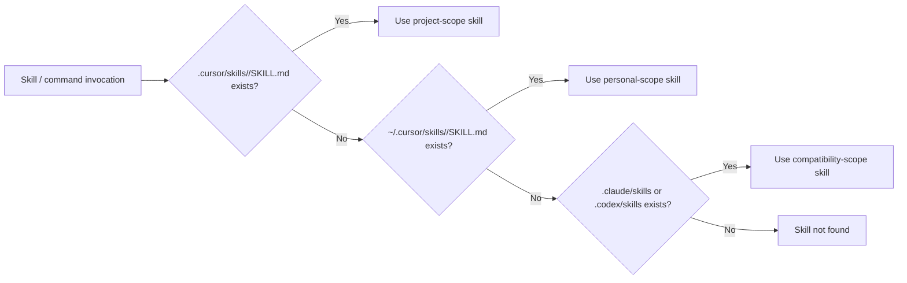
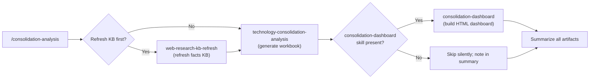
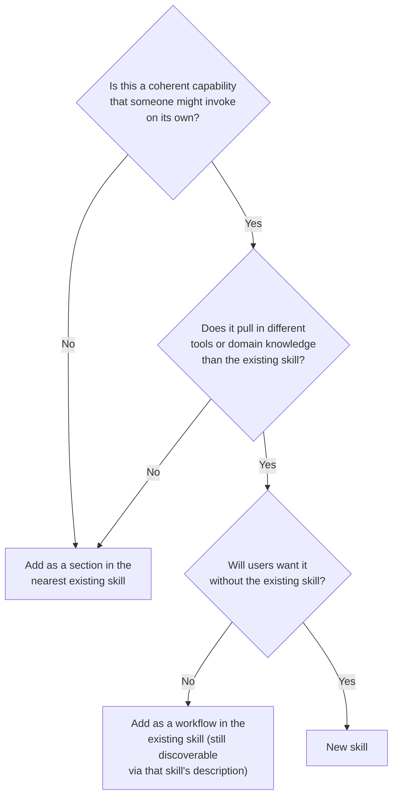

# Skills Composition - Patterns

How to build workflows that span more than one Cursor / Agent Skill cleanly. Covers chaining, scope resolution, graceful degradation, and the discipline of "one skill, one capability".

**Companion rules:**

- `015-context-engineering.mdc` - prompt packing, retrieval, compaction
- `100-core.mdc` - SOLID / DRY / KISS / YAGNI

---

## When to invoke

Use when designing:

- A slash command that needs to call more than one skill in sequence
- A skill that calls helpers in another skill (vs duplicating the logic)
- A workflow where a downstream skill is *optional* (graceful degradation)
- A new skill where the right answer might be "extend an existing skill instead"

Do *not* use for:

- Single-skill workflows - just call the skill directly
- One-off scripts - skills are for repeatable workflows

---

## The Five Golden Rules

1. **One skill, one capability.** A skill answers one question well. Multiple capabilities = multiple skills.
2. **Compose via commands, not by importing.** Skills do not "import" each other; a slash command (or another skill's workflow) orchestrates them.
3. **Project scope wins over personal scope.** A project-scope skill (`.cursor/skills/`) wins over a personal-scope copy (`~/.cursor/skills/`) of the same name.
4. **Auto-detect siblings; degrade gracefully.** When skill A optionally extends skill B, A checks for B at known paths and skips silently if absent.
5. **HITL gates between phases for irreversible steps.** Even within a single command, prompt before destructive or expensive steps.

---

## Skill scope resolution

Cursor (and Claude Code) discover skills at multiple paths. The resolution order:



**Implications:**

- A project can override a personal skill with the same name. Useful when one project needs custom behavior.
- A personal skill can be a default for many projects; project skills are for project-specific workflows.
- Hard-coded skill paths in commands break this. Use the resolution order; fall through gracefully.

### Reference snippet for path resolution

```bash
# Bash helper used by slash commands
resolve_skill_path() {
  local name="$1"
  for prefix in ".cursor/skills" "$HOME/.cursor/skills" ".claude/skills" "$HOME/.claude/skills"; do
    if [[ -f "$prefix/$name/SKILL.md" ]]; then
      echo "$prefix/$name"
      return 0
    fi
  done
  return 1
}
```

---

## Composition pattern 1 - Slash command chains skills

The most common pattern. A slash command orchestrates 2-3 skills with HITL gates between.

### Example: `/consolidation-analysis`



What makes this clean:

- **Each skill is invocable on its own** (`/facts-update`, `/build-dashboard`). The command is a convenience layer.
- **HITL gate before the expensive step** (refresh KB).
- **Sibling auto-detection** - the dashboard step is silently skipped if the skill is absent.
- **Single summary** at the end covers all produced artifacts.

### Anti-pattern: command does everything itself

If `/consolidation-analysis` had inlined all the workbook-generation logic, the dashboard logic, and the refresh logic, four things break:

1. The dashboard cannot be regenerated without re-running the workbook.
2. The refresh cannot be run independently.
3. Updates to one capability force changes to all callers.
4. There is no way to test pieces in isolation.

Skills + a thin orchestration command preserves all four.

---

## Composition pattern 2 - Skill A optionally extends skill B

Skill B is the canonical capability. Skill A adds a feature on top *if* B exists, but B can run without A.

### Example: `consolidation-dashboard` extends `technology-consolidation-analysis`

The consolidation analysis produces an Excel workbook. If `consolidation-dashboard` is installed, the analysis command also produces an HTML dashboard. If not, it does not.

Implementation:

- The downstream consumer (the analysis command, in this case) checks for the optional skill at the known path.
- If present, calls it. If absent, logs "skill not installed" and continues.
- The optional skill's failure does not fail the upstream skill.

```bash
# In the analysis command's last step
DASH="$(resolve_skill_path consolidation-dashboard)" || DASH=""
if [[ -n "$DASH" ]]; then
  python3 "$DASH/scripts/build_dashboard.py" --source "$WORKBOOK"
else
  echo "Note: consolidation-dashboard skill not installed; skipping HTML dashboard."
fi
```

The analysis step is independent. The dashboard step is opt-in.

---

## Composition pattern 3 - Workspace defaults + project overrides

Personal skills under `~/.cursor/skills/` are workspace-wide defaults. Project skills under `.cursor/skills/` override them by name.

Use cases:

- A personal `code-review` skill applies to every project; one project has a different style guide and ships its own `code-review/` to override it.
- A personal `release` skill follows the default flow; a regulated project has stricter gates and ships a project-scope `release/` that requires extra approvals.

**Rules:**

- The override is by `name:` in the SKILL.md frontmatter, not by directory name. Match the name exactly.
- The override is total - the personal skill is not "merged into" the project skill. The project skill replaces it.
- If the project skill needs the personal skill's logic, it should `# Related: personal version at ~/.cursor/skills/<name>` and either copy what it needs or call the personal version's helpers explicitly.

---

## Composition pattern 4 - Skill calls another skill's helpers

Skills do not import each other in code. But a skill's *helpers* (scripts, references) live on disk and can be called.

If skill A needs a function that skill B has implemented:

1. **First option** - factor the helper into a third location (a `lib/` shared between skills, or a small Python package the project can install).
2. **Second option** - skill A calls skill B's script as a subprocess, with explicit path resolution.
3. **Third option** (rare) - duplicate the helper in skill A. Acceptable only when the helper is trivial and skill A must work even if B is uninstalled.

Avoid implicit coupling. The skill graph should be readable from the SKILL.md files alone.

---

## Composition pattern 5 - Sequential vs parallel

| Pattern | When to use | Example |
|---|---|---|
| **Sequential** | Output of one skill is input to the next | KB refresh -> analysis -> dashboard |
| **Parallel** | Skills are independent and run on disjoint inputs | Lint + tests + security scan in CI |
| **Fan-out / fan-in** | One input, many parallel skills, one merged output | Audit a repo across 8 security layers, then summarize |

Most agentic workflows are sequential because each step's output reshapes the prompt for the next. Parallel composition is more common in CI than in interactive workflows.

---

## HITL gates between phases

Even within one command, prompt the user before:

- **Long-running steps** (>~5 minutes elapsed; >~10 web/tool calls)
- **Irreversible steps** (file writes outside `tmp/`, KB swaps, deploys, commits, pushes)
- **Cost-incurring steps** (paid API calls, model invocations beyond a budget)
- **Scope-expanding steps** (refresh "all" vs "gaps only" vs "specific")

Use `AskQuestion` with a small number of options (3-4) including a "no-op / cancel" option. Default to the safest option.

---

## "Should this be a new skill, or a section in an existing one?"

A pragmatic decision tree:



**Bias toward "section in existing skill"** for small additions. Skill sprawl makes the catalog hard to navigate.

---

## Anti-patterns

1. **Implicit chaining via shared global state** - skill A mutates a file at a known path; skill B reads it without knowing skill A produced it. Use explicit parameters or a clear contract.
2. **Hard-coded skill paths in commands** - `python3 ~/.cursor/skills/foo/scripts/bar.py`. Breaks when the skill is project-scoped.
3. **Optional sibling that is actually required** - if the workflow does not work without it, do not call it "optional". Either ship it as part of the upstream skill or document the dependency loudly.
4. **Skills that import code from each other** - turns skills into a Python package. Either make a real package or use subprocess + JSON contracts.
5. **Two skills with the same `name:`** - one always loses. Use distinct names; let the user choose by invoking the right one.
6. **Megaskills with 20 workflows** - each skill should answer one question well. If your SKILL.md needs a TOC, split it.
7. **No HITL before expensive operations** - "the agent will figure it out" is how you blow your model budget at 2am.

---

## Authoring checklist

When creating a new skill that composes with others:

- [ ] One sentence answers "what one capability does this provide?"
- [ ] Frontmatter `description:` covers the trigger phrases users will say
- [ ] If the skill calls another skill, document it in `## Related` and use path resolution (not hard-coded paths)
- [ ] If the skill is optional to a parent, the parent must check `resolve_skill_path` and degrade gracefully
- [ ] Each workflow is independently invocable (no hidden cross-workflow dependencies)
- [ ] HITL gates are explicit before destructive / long-running / cost-incurring steps
- [ ] Anti-patterns the skill should not enable are listed (so reviewers know what to flag)

---

## Authoring checklist for a slash command that composes skills

- [ ] Document the skills it depends on (with file paths) in the command body
- [ ] Use path resolution; do not hard-code `~/.cursor/...` or `.cursor/...`
- [ ] HITL gate before each phase that is destructive, expensive, or scope-expanding
- [ ] Final summary describes every artifact produced
- [ ] Optional skills' absence is communicated (not silently skipped)
- [ ] Failure of one skill does not corrupt artifacts produced by earlier skills
- [ ] Document idempotency: re-running the command on the same input is safe

---

## When NOT to compose

- **Single-step workflows** - just use the skill directly. A command that wraps one skill adds no value.
- **One-off scripts** - skills are for repeated workflows. A one-off belongs in `tmp/` or a notebook.
- **When the orchestration is the same as the underlying skill** - merge them.

---

## Related

- Rule: `015-context-engineering.mdc` - prompt packing, retrieval, compaction
- Rule: `100-core.mdc` - SOLID / DRY / KISS
- Skill: `web-research-kb-refresh` - canonical example of a skill that other skills compose with (see also the `/facts-update` template in its references)
- Skill: `agent-workflow` - workflow patterns for complex multi-step tasks

## Attribution

Patterns crystallized from a consulting-toolkit workspace where one slash command (`/consolidation-analysis`) orchestrates three skills (web-research-kb-refresh, technology-consolidation-analysis, consolidation-dashboard) with HITL gates between, sibling auto-detection, and graceful degradation when the dashboard skill is absent. The discipline of "one skill, one capability" is what makes the chain readable and maintainable.
