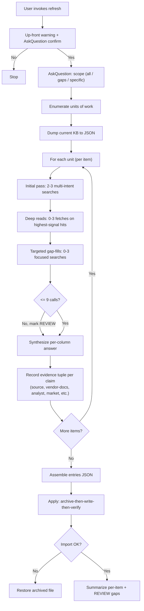

# Web-Research KB Refresh

Operational pattern for **refreshing a knowledge base from the web** with predictable cost, time, and provenance. Generalizes the consulting-toolkit `/facts-update` pattern so it applies to any KB-backed analysis (vendor facts, compliance posture, market data, security advisories, library/API references, etc.).

**Companion rules:**

- `015-context-engineering.mdc` - prompt packing, retrieval, compaction
- `120-utilities.mdc` - the underlying tools (lynx, curl, jq, ripgrep)
- `316-zero-trust.mdc` - audit and observability principles

---

## When to invoke

Use when the user asks to:

- "Refresh the KB" / "update the facts" / "regenerate from the web"
- "Pull current pricing / docs / advisories" for a list of items
- "Re-research vendor X across the catalog"
- Build a new long-running command that calls web tools at scale

Do *not* use for:

- One-off queries (just call `WebSearch` / `WebFetch` directly)
- Real-time streams (this pattern is batch-style)
- Anything where the answers are not stored in a structured KB

---

## The Five Golden Rules

1. **Hard cap per unit of work** - state it up front; refuse to exceed it.
2. **Cross-reference threshold** - claims need >=2 independent sources or 1 vendor-primary + 1 analyst.
3. **Up-front warning + explicit confirmation** before any potentially-long operation.
4. **Atomic write + rollback** - archive the old file *before* writing; verify the new file imports / parses; restore on failure.
5. **REVIEW placeholders, never fabrication** - if coverage is thin, mark the gap explicitly with reason; never silently invent.

---

## The pattern, end to end



---

## Workflow 1 - Set the budget and announce it

Before any web tool call:

1. **State the cap aloud.** "This refresh will run up to N web-tool calls per item, capped hard. For M items, that is roughly T minutes elapsed."
2. **`AskQuestion` to confirm.** Do not bury the cost; do not assume.
3. **`AskQuestion` to scope.** All items / gaps only / refresh existing only / specific list.
4. **Record the budget for the report.** It goes into the final summary.

Defaults that work for most KBs:

- **9 calls per item** (covers initial pass + deep reads + gap-fills with 1 to spare)
- **3 sources per claim** maximum (more is noise, not confidence)
- **2 sources per claim** minimum, OR 1 vendor-primary corroborated by 1 analyst
- **REVIEW threshold** at the cap: if coverage is still thin at call 9, mark the gap and move on

Tune per domain - security advisories may need fewer calls (CVE feeds are authoritative); market data may need more (more triangulation needed).

---

## Workflow 2 - Multi-intent queries (economize calls)

The single biggest lever on cost. **One query, several intents.**

Bad (6 calls for one item):

```
"Confluent Kafka overview"
"Confluent Kafka pricing"
"Confluent Kafka competitors"
"Confluent Kafka company stability"
"Confluent Kafka anti-patterns"
"Confluent Kafka biggest competitor"
```

Good (3 calls for the same coverage):

```
"Confluent Kafka 2026 overview competitors pricing"
"Confluent Kafka company stability ownership 2026"
"Confluent Kafka vs <likely_competitor> comparison"
```

The first query covers four research columns; the second covers two; the third triangulates the comparison column. Shapes the sources to corroborate each other, not duplicate.

---

## Workflow 3 - Cross-referencing rule

A claim is sound when:

- **Two independent sources agree**, OR
- **One vendor-primary source is corroborated by one analyst/market source**

Never:

- **One source for a non-obvious claim** (mark REVIEW)
- **Four or more sources** for the same claim (noise; cap at 3)
- **All vendor sources for a competitor comparison** (use analyst sources for those)

Source taxonomy (carry into the evidence tuples):

| Tag | Use |
|---|---|
| `source` | The original input file / brief / spec |
| `vendor-docs` | Vendor's own product, docs, pricing, SDK pages |
| `analyst` | Gartner, Forrester, IDC, 451, GigaOm, etc. |
| `market` | Rate cards, salary surveys, public benchmarks |
| `case-study` | Public migration / customer story |
| `judgement` | Analyst judgment carried over (use sparingly) |
| `regulator` | FDA / FCC / SEC / etc. official text (compliance KBs) |
| `cve` | NVD / GitHub Advisory / vendor security bulletin (security KBs) |

---

## Workflow 4 - Atomic write with rollback

The point: downstream consumers (generators, dashboards, slash commands) import a **canonical filename**. The refresh must be transparent to them - they should not need to learn a new filename. So:

1. **Archive the old file** to `<canonical>_<YYYYMMDD-HHMMSS>.<ext>` where the timestamp is `now - 1 second` (the moment *before* the new file is written). The archive sits next to the canonical file.
2. **Write the new canonical file** from the assembled entries.
3. **Verify** by importing / parsing it. For Python KBs, `python -c 'import <module>'`. For JSON / YAML, parse and validate against a schema.
4. **Rollback automatically** if verification fails - restore the archived file to canonical, surface the error.

Reference Python helper sketch:

```python
import shutil
import time
import importlib
from pathlib import Path

def atomic_swap_kb(canonical: Path, new_content: str, importable_module: str) -> Path:
    archive_ts = time.strftime("%Y%m%d-%H%M%S", time.gmtime(time.time() - 1))
    archive = canonical.with_name(f"{canonical.stem}_{archive_ts}{canonical.suffix}")
    if canonical.exists():
        shutil.copy2(canonical, archive)
    canonical.write_text(new_content)
    try:
        importlib.invalidate_caches()
        importlib.import_module(importable_module)
    except Exception as exc:
        if archive.exists():
            shutil.copy2(archive, canonical)
        raise RuntimeError(f"Refresh aborted; canonical restored from {archive}") from exc
    return archive
```

For non-Python KBs the verification step is whatever proves the file is valid (JSON parse, YAML parse + schema check, SQL load + select).

### Why archive-then-write-then-verify (not write-then-archive)?

If the write succeeds but verification fails, you still have the old file at the archive path - you can roll forward (keep the broken new file for diagnosis) or roll back (restore the archive). Either way, the canonical filename is never left in an unknown state.

---

## Workflow 5 - Separate research columns from analyst-judgment columns

The most-overlooked part of this pattern. Two classes of fields live in the same KB:

| Class | Examples | Refreshable from web? | Refresh rule |
|---|---|---|---|
| **Research** | `category`, `pricing`, `company_stability`, `market_position`, `competitor`, `release_cadence`, `cve_status` | Yes | Regenerate every refresh |
| **Judgment** | `default_decision`, `recommended_target`, `migration_strategy`, `decision_rationale` | No - depends on portfolio + intent | Carry over from existing KB; for new items, use `REVIEW - set after first run` |

Refresh only the research columns. **Never overwrite analyst-judgment columns** unless the user explicitly requests an analyst-judgment refresh (a separate, distinct operation). State this explicitly in the up-front warning.

---

## Workflow 6 - REVIEW placeholders (never fabrication)

When coverage is thin (cap hit, sources disagree, vendor went quiet), do not invent. Mark the field with a placeholder:

```
"company_stability": "REVIEW - insufficient online coverage; last public funding 2024-Q3, no 2025/2026 disclosures found"
```

Add a `judgement` evidence tuple explaining the gap:

```
("judgement", "REVIEW placeholder: cap reached at 9 calls; vendor materials current to 2024-Q3 only.")
```

Surface every REVIEW prominently in the final summary so the analyst knows what to spot-check.

---

## Workflow 7 - Per-item summary in the final report

The user needs to know what changed and what didn't. For each refreshed item, list the **2-3 most load-bearing sources** (not all evidence - just the spine):

```
- Confluent Kafka - Confluent Cloud pricing (vendor-docs) + Gartner Magic
  Quadrant 2025 (analyst) + AWS MSK comparison (vendor-docs)
  -> 7 research columns refreshed; judgment fields carried over
- Apache Airflow - apache.org docs (vendor-docs) + Astronomer State of
  Airflow 2025 (analyst)
  -> 6 research columns refreshed; 1 REVIEW (cost_structure - vendor lists
     no fixed price, MWAA/Composer comparisons available)
```

End the summary with:

- **Archive path** of the prior file (so the user can diff or roll back).
- **REVIEW placeholders** count + brief reason for each.
- **Suggested next step** (typically: re-run the downstream analysis to see new facts reflected).

---

## Reference command structure

A `/refresh-<kb-name>` slash command implementing this pattern looks like this. Adapt to your KB.

```markdown
---
description: Refresh the <KB name> from web research. POTENTIALLY LONG-RUNNING - <N> web-tool calls per item, capped at <CAP>.
---

The user wants to refresh the <KB name>.

Operating rules:

1. Source file: ...
2. Up-front warning: tell the user this is long-running and confirm.
3. Scope prompt: all / gaps / refresh-existing / specific list.
4. Enumerate items.
5. Dump current KB.
6. Per item, run the research protocol with HARD CAP at <CAP> web-tool calls.
7. Cross-reference <=3 sources per claim, >=2 independent or vendor+analyst.
8. Synthesize concise (1-3 sentence) answers per column.
9. Record per-claim evidence tuples with source tags.
10. REVIEW any column not corroborated within the cap; never fabricate.
11. Carry over judgment columns from existing KB; placeholders for new.
12. Apply: archive-then-write-then-verify; rollback on failure.
13. Summarize: per-item load-bearing sources, archive path, REVIEW count, next step.
14. Do NOT touch judgment columns or unrelated KBs.
```

A reference helper script ([references/atomic-swap.py](references/atomic-swap.py)) implements the archive-write-verify-rollback step.

---

## Anti-patterns

1. **No cap.** "I'll just keep searching until I have enough." Result: hours of runtime, blown budget, and no signal-to-noise improvement past call 4-5.
2. **Single source per claim.** Vendor pages are marketing; analysts can be wrong. Two independent corroborations or vendor-primary + analyst is the floor.
3. **More than 3 sources per claim.** Adds noise without adding confidence; doubles the search budget.
4. **Mixing research and judgment.** "I'll regenerate the whole row." Analyst-judgment columns depend on portfolio + intent context that the web does not have.
5. **Write before archive.** Old file is lost if the write succeeds but verify fails.
6. **Silent fabrication.** "I will just guess" - or, worse, "the model is confident" - is how a refresh becomes a liability.
7. **No up-front warning.** Long operations without consent feel like an outage.
8. **Renaming the canonical file.** Every downstream consumer breaks. Archive instead.
9. **No per-item summary.** The user has no idea what changed.

---

## When NOT to use this pattern

- **One-off queries** - call `WebSearch` / `WebFetch` directly.
- **Streaming / continuous data** - use a real ingestion pipeline.
- **Real-time price quotes / market ticks** - use an API, not web search.
- **CVE-only refresh on a single library** - just `pip-audit` / `osv-scanner` / `npm audit`.

The pattern shines when you have **a structured KB, multiple items, periodic refresh**, and you need every refresh to be **predictable, reviewable, and reversible**.

---

## References

- [references/atomic-swap.py](references/atomic-swap.py) - reference Python helper for archive-write-verify-rollback
- [references/refresh-command-template.md](references/refresh-command-template.md) - reusable slash-command template

## Related

- Rule: `015-context-engineering.mdc` - prompt packing, retrieval, compaction
- Rule: `120-utilities.mdc` - the underlying tools (lynx, curl, jq, ripgrep)
- Rule: `316-zero-trust.mdc` - audit and observability principles
- Skill: `core-engineering` - general engineering discipline
- Skill: `skills-composition` - chaining this with downstream analysis skills

## Attribution

Pattern crystallized from a consulting-toolkit `/facts-update` command that refreshed 13 product KBs from web research with a 9-call cap and atomic-swap rollback. The discipline pays off most when a refresh feeds a downstream analysis: the analyst can trust the new facts because the refresh is bounded, attributable, and reversible.
