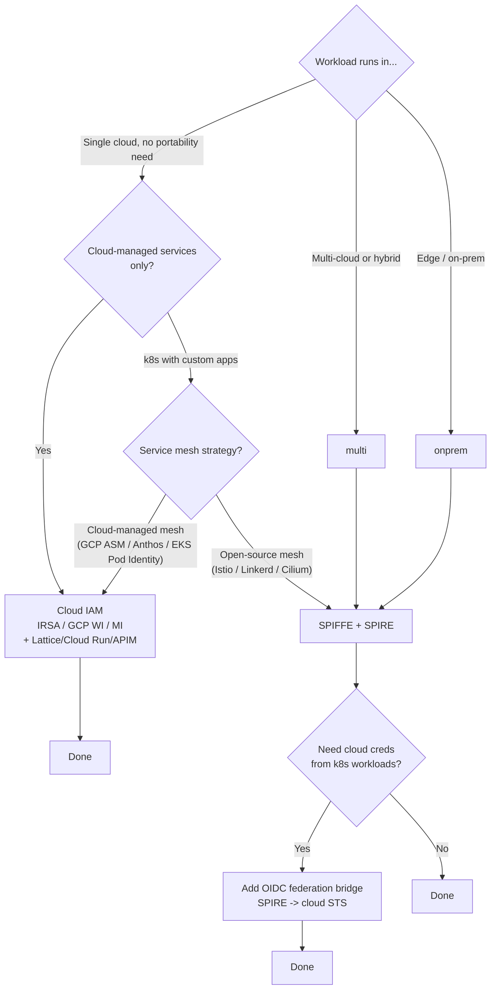

# SPIFFE vs Cloud IAM - Decision Matrix

The core architecture decision for service-to-service identity. Use this to write the ADR.

---

## TL;DR

The cloud-native primitives (IRSA, GCP Workload Identity, Azure Managed Identity, VPC Lattice) are **substitutes** for SPIFFE inside one cloud, not complements. Pick one per workload class. At the *platform* level, most enterprises use both - SPIFFE for portable / k8s east-west, cloud IAM for cloud-native single-cloud.

---

## Dimensions to score

| Dimension | SPIFFE + mTLS | Cloud IAM (Lattice / GCP WI / Managed Identity) |
|---|---|---|
| Identity source | Attestation of workload properties | Cloud-managed principal |
| Portability | Multi-cloud, on-prem, edge | Single cloud |
| Ops burden | High (run SPIRE HA, CA, observability) | Fully managed |
| Cross-cloud / hybrid | Native (federation) | External glue (OIDC fed) |
| Policy language | OPA / Istio AuthZ / custom | IAM JSON policies |
| Workload attestation granularity | Down to image digest | Down to IAM role (not the binary) |
| Cost | SPIRE servers + datastore + observability | Built into cloud bill |
| Vendor lock-in | Low | High (per cloud) |
| Time-to-MVP | Weeks (cluster setup, CA, registration model) | Days (existing cloud IAM) |
| Audit surface | SPIRE audit log + cloud + app | Cloud audit (CloudTrail / Cloud Audit Logs / Azure Activity Log) |
| Good fit | Multi-cloud platforms, ISVs, k8s-first | Cloud-native single-cloud, IAM-deep teams |

---

## Decision tree



---

## Common patterns

### "Pure cloud IAM" (single-cloud, IAM-deep)

- Workloads use cloud-native identity end-to-end.
- AWS: IRSA / Pod Identity / Lambda role; **VPC Lattice + `AWS_IAM` + SigV4** for service-to-service.
- GCP: Workload Identity + Cloud Run/Endpoints/Internal HTTP(S) LB with IAM auth.
- Azure: Managed Identity + APIM / Private Link Service with managed-identity auth.
- No SPIRE.

### "Pure SPIFFE" (multi-cloud or strict portability)

- SPIRE deployed per cluster (or nested) with a single trust domain per environment.
- All east-west via mTLS with X.509-SVIDs.
- Cloud access via OIDC federation (Workflow 4).
- No long-lived cloud keys anywhere.

### "Both, segmented" (most enterprise reality)

- SPIFFE for k8s east-west (where the platform team owns identity).
- Cloud IAM for serverless / cloud-managed services (where the cloud already attests).
- The boundary is documented in the ADR. The two never overlap on a single workload.
- OIDC federation bridges where a SPIFFE-attested workload needs cloud creds.

---

## Anti-decisions (don't do these)

- **"We'll use both for the same workload."** Pick one substrate per workload class. Layering both adds attack surface and ops work without adding security.
- **"We'll do SPIFFE because it's modern."** Modern is not the criterion. Portability, attestation granularity, and ops capacity are. If you're single-cloud and cloud-managed, cloud IAM beats SPIFFE.
- **"We'll do cloud IAM because SPIFFE is hard."** Acceptable iff you're committed to single-cloud for the foreseeable future. Document the trade-off in the ADR so it can be re-opened.
- **"We'll roll our own."** SPIRE exists. Pre-built upstream authorities exist. Building your own attestation layer is a multi-year team commitment.

---

## ADR template

```markdown
# ADR: Workload identity substrate

## Status: Proposed

## Context
- What workloads, what platforms, what clouds, what threat model
- Existing identity primitives in use

## Decision
- Substrate chosen: SPIFFE / Cloud IAM / Both segmented
- Boundary (if both): which workloads use which

## Rationale
- Score against the dimensions matrix above
- Specific drivers: portability, attestation granularity, ops capacity, IAM depth, mesh strategy

## Consequences
- Ops cost (control plane, on-call rotation, training)
- Security gains
- Lock-in implications
- Migration cost

## Alternatives considered
- The other option, why not chosen

## Re-evaluation triggers
- Multi-cloud requirement emerges
- Mesh strategy changes
- Significant team capacity shift
```

---

## Related

- Rule: `318-workload-identity.mdc`
- Reference: [spire-on-eks.md](spire-on-eks.md) (if SPIFFE is chosen for EKS)
- Reference: [oidc-federation-bridges.md](oidc-federation-bridges.md) (if SPIFFE + cloud creds)
