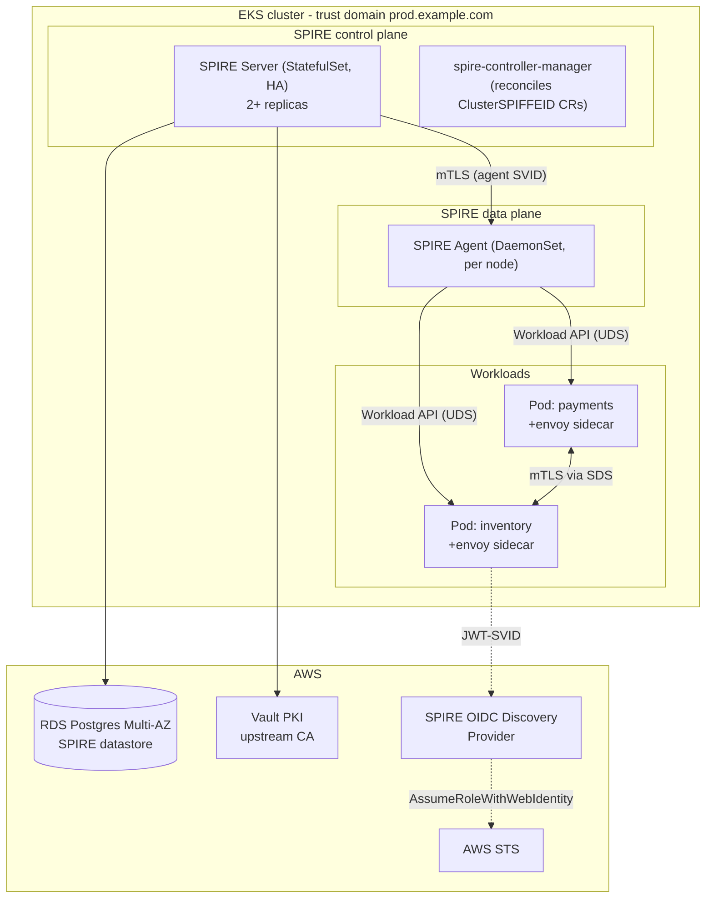

# SPIRE on EKS - Reference Pattern

Production-grade SPIRE on EKS with image-digest selectors and Vault PKI as the upstream CA.

---

## Architecture



---

## Components

### SPIRE Server (StatefulSet, HA)

- 2+ replicas behind an internal NLB (or `headless` Service for client-side LB).
- Datastore: RDS Postgres (Multi-AZ), encrypted at rest, in private subnets, security group allows only SPIRE Server pods.
- UpstreamAuthority: Vault PKI (or AWS Private CA). SPIRE Server is intermediate; root stays in HSM-backed Vault / PCA.
- ServiceAccount: minimal RBAC, no cluster-admin.
- Config:

  ```hcl
  server {
    bind_address = "0.0.0.0"
    bind_port = "8081"
    trust_domain = "prod.example.com"
    data_dir = "/run/spire/data"
    log_level = "INFO"
    ca_ttl = "168h"          # 7 days
    default_x509_svid_ttl = "1h"
    default_jwt_svid_ttl = "5m"
    audit_log_enabled = true
  }

  plugins {
    DataStore "sql" {
      plugin_data {
        database_type = "postgres"
        connection_string = "..."
      }
    }
    UpstreamAuthority "vault" {
      plugin_data {
        vault_addr = "https://vault.example.com:8200"
        pki_mount_point = "pki_int_spire"
        cert_auth { ... }
      }
    }
    NodeAttestor "k8s_psat" {
      plugin_data {
        clusters = {
          "prod-eks" = {
            service_account_allow_list = ["spire:spire-agent"]
          }
        }
      }
    }
    KeyManager "aws_kms" {
      plugin_data {
        region = "us-east-1"
        key_arn = "arn:aws:kms:..."
      }
    }
    Notifier "k8sbundle" {
      plugin_data {}
    }
  }
  ```

### SPIRE Agent (DaemonSet)

- One per node, runs as privileged for `/proc` and CRI socket access.
- Hostpath volume mount: `/run/spire/sockets/agent.sock` (the Workload API UDS).
- Node attestor: `k8s_psat` (Projected Service Account Token) - no shared secret.
- Workload attestors: `k8s` (namespace, SA, image digest) + `unix` (UID/GID, process metadata).

### spire-controller-manager

- Reconciles `ClusterSPIFFEID` CRs into SPIRE registration entries.
- Lets workload teams declare their identity in Git.
- Example CR:

  ```yaml
  apiVersion: spire.spiffe.io/v1alpha1
  kind: ClusterSPIFFEID
  metadata:
    name: payments-checkout
  spec:
    spiffeIDTemplate: "spiffe://prod.example.com/ns/{{ .PodMeta.Namespace }}/sa/{{ .PodSpec.ServiceAccountName }}"
    podSelector:
      matchLabels:
        app: checkout
    namespaceSelector:
      matchLabels:
        env: prod
    workloadSelectorTemplates:
      - "k8s:container-image:registry.example.com/checkout@sha256:abc..."
  ```

---

## Authorization layer

mTLS proves *who*; **authorization is separate**. Use one of:

- **Istio AuthorizationPolicy** with `source.principal: "spiffe://prod.example.com/ns/payments/sa/checkout"`.
- **Envoy ext_authz** to OPA for Rego-based policy.
- **Library check** in the receiving service (`go-spiffe` `tlsconfig.AuthorizeID`).

Default-deny per service. Explicit allow for known callers.

---

## OIDC bridge to AWS STS (no static keys for cloud calls)

1. Deploy SPIRE OIDC Discovery Provider exposing `.well-known/openid-configuration` at a stable HTTPS URL (typically behind ALB / CloudFront).
2. AWS IAM: register the SPIRE OIDC issuer as an Identity Provider.
3. Per cloud role, trust policy:

   ```json
   {
     "Version": "2012-10-17",
     "Statement": [{
       "Effect": "Allow",
       "Principal": { "Federated": "arn:aws:iam::ACCOUNT:oidc-provider/spiffe-oidc.example.com" },
       "Action": "sts:AssumeRoleWithWebIdentity",
       "Condition": {
         "StringEquals": {
           "spiffe-oidc.example.com:sub": "spiffe://prod.example.com/ns/payments/sa/checkout",
           "spiffe-oidc.example.com:aud": "sts.amazonaws.com"
         }
       }
     }]
   }
   ```

4. Workload requests JWT-SVID via Workload API (audience `sts.amazonaws.com`) and calls `AssumeRoleWithWebIdentity`.
5. No long-lived AWS keys anywhere.

---

## Operational SLOs

| Metric | Target |
|---|---|
| SVID issuance latency (workload start → first SVID) | p99 < 5s |
| SVID renewal failure rate | < 0.01% |
| Workload starts running within T < TTL of expiration without renewal | 0 |
| mTLS handshake success | > 99.9% per service |
| SPIRE Server availability | > 99.95% |
| Audit log shipping latency | < 60s |

---

## Disaster recovery

- **Datastore backup**: nightly RDS snapshots, weekly export to S3 with Object Lock.
- **Trust bundle export**: cron job dumps the bundle to a known S3 location for cross-region recovery.
- **Upstream CA rotation**: documented runbook; SPIRE supports `tainted_keys` for graceful CA roll.
- **Restore drill**: quarterly. Restore from snapshot in a parallel namespace, verify SVID issuance, federate test domain.

---

## Migration phases

1. **Phase 1 - Deploy + shadow**: SPIRE installed, agents running, ClusterSPIFFEIDs declared, but workloads do not enforce mTLS. Logs only.
2. **Phase 2 - Per-service enforcement**: turn on Istio `PERMISSIVE` then `STRICT` mTLS per service. Watch error budget.
3. **Phase 3 - Default-deny**: AuthorizationPolicy denies by default; explicit allow per service.
4. **Phase 4 - Cloud bridge**: enable OIDC discovery, migrate workloads off IRSA static role mappings to SPIFFE-bound trust policies (where it makes sense).

Each phase has a rollback (revert to `PERMISSIVE`, revert to `ALLOW`, revert to old IRSA mapping).

---

## Anti-patterns specific to EKS

- **Running SPIRE Server on the same node as workloads it identifies** - HA constraint, place on dedicated nodes.
- **One trust domain across `dev`/`stage`/`prod` clusters** - don't.
- **No KeyManager** - SPIRE Server's signing key in plain disk vs in AWS KMS / HSM. Use KMS.
- **`audit_log_enabled = false`** - turn it on; ship to SIEM.
- **Skipping the upstream authority** - acceptable for dev, never prod.

---

## Related

- Rule: `318-workload-identity.mdc`
- Rule: `412-aws-iam.mdc` (IRSA, Pod Identity)
- Rule: `450-kubernetes.mdc` (mesh patterns)
- Reference: [spiffe-vs-cloud-iam.md](spiffe-vs-cloud-iam.md)
- Reference: [oidc-federation-bridges.md](oidc-federation-bridges.md)
